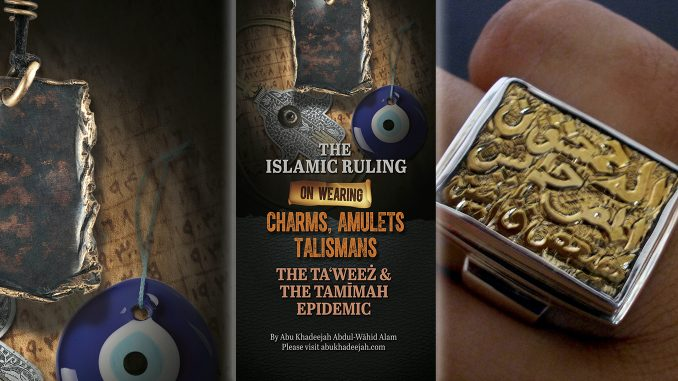

## Charms, Amulets and Talismans― Fortune-Tellers, Soothsayers and Astrologers in Light of the Qur’an and Sunnah

#### Quick Definitions:

<b><i>Seance:</i></b> a meeting at which people attempt to make contact with the dead, especially through the agency of a medium. 
<b><i>Fortune-teller:</i></b> a person who is supposedly able to predict a person’s future by palmistry, using a crystal ball, or similar methods. 
<b><i>Soothsayer:</i></b> a person supposed to be able to foresee the future. 
<b><i>Astrologer:</i></b> the study that assumes and attempts to interpret the influence of the heavenly bodies on human affairs. 
<b><i>Talisman:</i></b> An object, typically an inscribed ring or stone, that is thought to have magic powers and to bring good luck. 
<b><i>Charm:</i></b> A good luck charm or lucky charm is an item that is believed to bring luck. 
<b><i>Amulet:</i></b> an ornament or small piece of jewellery thought to give protection against evil, danger, or disease.

download to your device by clicking the [download PDF](http://www.abukhadeejah.com/wp-content/uploads/2020/01/Amulets-Charms-Taweez-2020-Ebook.pdf) button.
